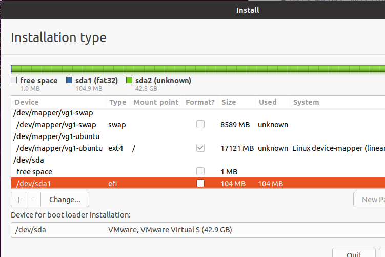
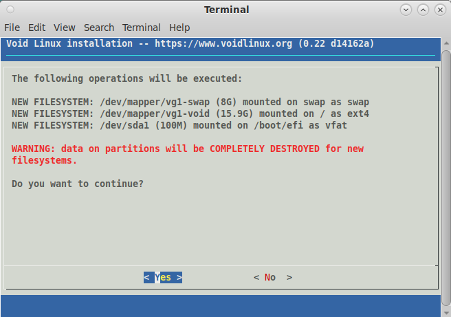
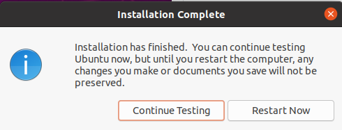
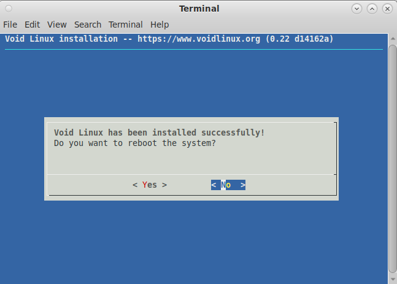

# Ubuntu/Void-Linux installation into the LVM on the LUKS volume

Installation requires mainly 2 steps. 
 
- Configure the parameters in config.sh.
- Run the kaiten-yaki script

You can execute the install script without the command line parameter. For example :
```sh
source ubuntu-kaiten-yaki.sh
```
The first stage of the script is preparation like: erasing a disk, format partition, and encryption. This is the most critical stage of the entire installation process. This part is controlled by the configuration parameter. Thus, you have to edit the config.sh carefully. 

In the second stage, the distribution-dependent GUI/TUI installer is invoked from the running script. That is the Ubiquity/void-installer of Ubuntu/Void Linux, respectively. 

The third stage configures the target Linux system to decrypt the encrypted volume automatically, without prompting user to type passphrase. In this stage, Everything is automatic. 
# Installation
Follow the steps below. 

## Shell preparation
First of all, promote the shell to root. Kaiten-yaki script requires root permission to edit the storage device. Note that the scripts require Bash as shell. 

In the case of Ubuntu installation:
```sh
# Promote to the root user
sudo -i /bin/bash
```
In the case of Void Linux installation: 
```sh
# Promote to the root user
sudo -i /bin/bash
xbps-install -Su xbps nano
```
The nano is an editor package to configure the config.sh. The choice of editor is up to you. Kaiten-yaki script doesn't have a dependency on nano editor.

And then, go to the kaiten-yaki/script directory. 
```sh
cd /the/downloaded/directory/kaiten-yaki/script
```
Now, ready to configure. 
## Configuration parameters
This is a very critical part of the installation. The configuration parameters are in the config.sh. Edit these parameters before the installation. 

Followings are the set of the default settings of the parameters : 
- Install to  **/dev/sda** (DEV).
- Do not erase the entire disk (ERASEALL).
- Do not overwrite the existing logical volume (OVERWRITEINSTALL).
- In the case of EFI firmware, 200MB is allocated to the EFI partition (EFISIZE).
- Create a logical volume group named "vg1" in the encrypted volume (VGNAME)
- Create a swap logical volume named "swap" in the "vg1". The size is 8GB (LVSWAPNAME,LVSWAPSIZE)
- Create a logical volume named **"anko"** as root volume,  in the "vg1". The size of the new volume is the **50%** of the free space (LVROOTNAME, LVROOTSIZE).

```sh
# Configuration parameters for Kaiten-Yaki 

# Storage device to install the linux.  
export DEV="/dev/sda"

# Whether you want to erase all contents of the storage device or not.
# 1 : Yes, I want to erase all.
# 0 : No, I don't. I want to add to the existing LUKS volume. 
export ERASEALL=0

# Logical Volume name for your Linux installation. 
# Keep it unique from other distribution.
export LVROOTNAME="anko"

# Logical volume size of the Linux installation.
# 30% mean, new logical volume will use 30% of the free space 
# in the LVM volume group. For example, assume the free space is 100GB, 
# and LVROOTSIZE is 30%FREE. Script will create 30GB logical volume.  
export LVROOTSIZE="50%FREE"

# Set the size of EFI partition and swap partition. 
# The unit is Byte. You can use M,G... notation.
export EFISIZE="200M"
export LVSWAPSIZE="8G"

# Usually, these names can be left untouched. 
# If you change, keep them consistent through all installation in your system.
export CRYPTPARTNAME="luks_volume"
export VGNAME="vg1"
export LVSWAPNAME="swap"

# Do not touch this parameter, unless you understand what you are doing.
# 1 : Overwrite the existing logical volume as root volume. 
# 0 : Create new logical volume as root volume. 
export OVERWRITEINSTALL=0

# Do not touch this parameter, unless you understand what you are doing.
# This is a paameter value of the --iter-time option for cyrptsetup command. 
# If you specify 1000, that means 1000mSec. 0 means compile default.  
export ITERTIME=0

```

There are several restrictions : 
- For the first distribution installation, you must set ERASEALL to 1, to erase the entire storage device and create a LUKS partition. Kaiten-yaki script creates a maximum LUKS partition as possible. 
- The LVROOTNAME must be unique among all installations in a computer. Otherwise, Kaiten-yaki terminates in a middle. 
- The LVSWAPNAME must be identical among all installations in a computer. Otherwise, Kaiten-yaki creates an unnecessary logical volume. This is a waste of storage resources. 
- The EFISIZE and the LVSWAPSIZE are refereed during the first distribution installation only. 
- The LVROOTSIZE is the size of a logical volume to create. This is a relative value to the existing free space in the volume group. If you want to install 3 distributions in a computer, you may want to set 33%FREE, 50%FREE, and 100%FREE for the first, second, and third distribution installation, respectively. 
- The name with "-" is not allowed for the VGNAME, LVROOTNAME, and LVSWAPNAME. I saw some installer doesn't work if "-" in in the name. 
### About the overwrite-install
The OVERWRITEINSTALL parameter allows you to use an existing logical volume as the root volume of the new installation.
This is very dangerous because of several aspects like destroying the wrong volume and the risk of security. But sometimes it is
very useful. 

For example, assume you are installing a distribution by Kaiten-yaki. If you reboot the system at the end of GUI/TUI installer by mistake, your system may never boot again. 
In this case, the overwrite-install can recycle this "bad" logical volume and let your system boot again. 

To use the overwrite-install, you have to set some parameters as follows: 
- ERASEALL : 0
- OVERWRITEINSTALL : 1

And set the following parameters as same as the previous installation. 
- LVROOTNAME
- VGNAME
- CRYPTPARTNAME

Kaiten-yaki will leave the LUKS encrypted partition and allow you to overwrite the "bad" logical volume by GUI/TUI installer. 
### About ITERTIME parameter
This parameter is recommended to left as default value (=0), unless you understand what it mean well. 

The ITERTIME parameter is passed as --iter-time parameter to the [cryptosetup command](https://man7.org/linux/man-pages/man8/cryptsetup.8.html), when script setup the LUKS crypto volume. See [AN03](https://github.com/suikan4github/kaiten-yaki/wiki/AN03:-The-ITERTIME-parameter-and-vulnerability)

The unit of value is milliseconds. The target linux kernel may take this duration, to calculate a hash value from the given passphrase. You can change this duration through this parameter. 

The smaller value gives the weaker security. 

## First stage: Setting up the volumes
After you set the configuration parameters correctly, execute the following command from the shell. Again, you have to be promoted as the root user, and you have to use Bash.  

In the case of Ubuntu :
```sh
source ubuntu-kaiten-yaki.sh
```

In the case of Void Linux
```sh
source void-kaiten-yaki.sh
```
After printing the configuration parameters, Kaiten-yaki will prompt you to input a passphrase. This passphrase will be applied to the encryption of the LUKS volume. Make sure you use identical passphrases between all installations of the distributions in a computer. Otherwise, the install process terminates with an error, except the case of the ERASEALL configuration parameter is 1.  

## Second stage : GUI/TUI installer
After the first script finishes, the GUI/TUI installer starts automatically. Configure it as usual and run it. Ensure you map the following correctly.
Target Directory | Host Volume            | Comment
-----------------|------------------------|---------------------------------------------------------------
/boot/efi        | /dev/sda1              | BIOS system doesn't need this mapping
/                | /dev/mapper/vg1-ubuntu | Host volume name is up to your configuration parameter.
swap             | /dev/mapper/swap       | Only the first distribution installation requires this mapping.

During the GUI/TUI installer copying files, Kaiten-yaki modifies the /etc/default/grub of the target system. This is a pretty dirty way. But if we don't modify this file, GUI/TUI installer fails at last. 




### Do not reboot
At the end of the GUI/TUI installing, do not reboot the system. Click "Continue" and just exit the GUI/TUI installer without rebooting. Otherwise, we cannot finalize the entire installation process. 




## Third stage: Finalizing
After GUI/TUI installer quits without rebooting, the final part of the install process automatically starts. 

In this section, Kaiten-yaki put the encryption key of the LUKS volume into the initramfs image to allow the Linux kernel  decrypting the LUKS partition which contains root logical volume. Thus, the system will ask you the passphrase only once when GRUB starts. 

You can reboot the system if you see the "Ready to reboot" message on the console. 

