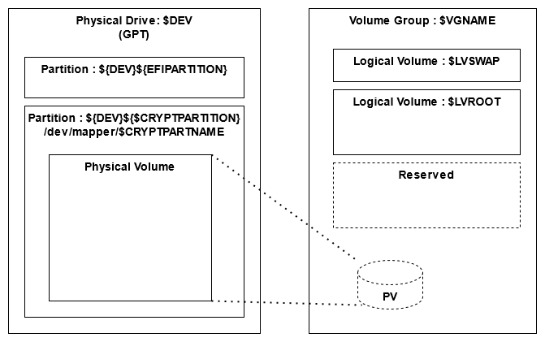

# Kaiten-yaki: Full disk encryption install script for Linux
Kaiten-yaki v1.3.0 is a script set to install Linux to your AMD64 desktop system. With these scripts, you can install Ubuntu/Void Linux to an encrypted partition easily. 

The followings are the list of functionalities: 
- Ubuntu and Void Linux support.
- Help to install from LiveCD/USB.
- Invoke GUI/TUI installer automatically at the middle of script execution, for the ease of installation.
- Automatic detection of EFI firmware and create GPT (The BIOS detection and MBR creation function exist. But they are not tested from v1.3.0).
- Create an EFI partition, if needed.
- Support multiple boot in a LUKS partition.
- Support btrfs in addition to the major file systems. 
- The "/boot" is located in the same encrypted logical volume with the "/". 
- The swap is located in the same encrypted logical volume with the "/". 
- You need to type a passphrase only once in the boot sequence of the installed system. 

With the configuration parameters, you can customize each installation.  For example, you can configure the system to have 2, 3, or 4,... distributions in an HDD/SSD, as you want. 

Following is the HDD/SSD partitioning plan of these scripts ( In the case of BIOS, the disk has MBR and doesn't have an EFI partition). 

The logical volume size of each Linux distribution (LVROOTSIZE) can be customized from a configuration parameter. Also, the swap volume size is customizable. 

As depicted above, the LVM volume group has only one physical volume. 

# Tested environment
These scripts are tested with the following environment. 
- VMVare Workstation 15.5.7 ( EFI )
- Ubuntu 22.04 amd64 desktop
- void-live-x86_64-20210930-xfce.iso
- void-live-x86_64-20210930.iso
- Followings are the tested environment of the Kaiten-Yaki v1.2.0
    - VMWare Workstation 15.5.7 ( EFI/BIOS )
    - ThinkPad X220 (BIOS)
    - Ubuntu 20.04.3 amd64 desktop
    - Ubuntu 21.04 amd64 desktop
    - Ubuntu 21.10 amd64 desktop
    - Ubuntu Mate 20.04.3 amd64 desktop
    - void-live-x86_64-20210218-mate.iso
    - void-live-x86_64-musl-20210218-mate.iso
    - void-live-x86_64-20210218.iso

# Installation
Rough procedure of the installation is as followings : 
1. Start the PC with the LiveCD/LiveUSB of the distribution to install
1. Download this repository from GitHub
3. Run the script.

The detail procedure is explained in the [INSTALL.md](INSTALL.md).

# Variants considerations
Ubuntu has several variants ( flavors ). While while only the Ubuntu desktop is tested, other flavors may work correctly as far as it uses Ubiquity installer.

# Other resources
See [Wiki](https://github.com/suikan4github/kaiten-yaki/wiki) for the application notes and the useful links. 

# Acknowledgments
These scripts are based on the script by [myn's diary](https://myn.hatenablog.jp/entry/install-ubuntu-focal-with-lvm-on-luks). That page contains rich information, hint, and techniques around the encrypted volume and Ubiquity installer. 

Also, the following documents were very important to study how Void Linux installation works. 
- [Full Disk Encryption](https://docs.voidlinux.org/installation/guides/fde.html) in the Void Handbook. 
- [Install LVM LUKS](https://wiki.voidlinux.org/Install_LVM_LUKS) (deprecated)[[archive](https://web.archive.org/web/20201112031114/https://wiki.voidlinux.org/Install_LVM_LUKS)].
# Kaiten-yaki

