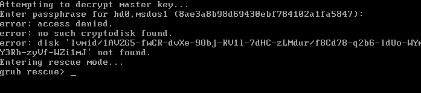
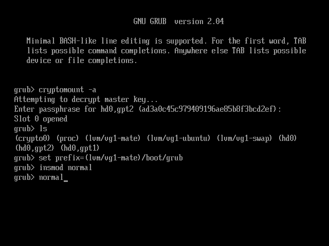
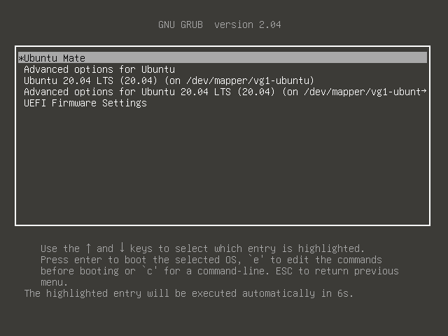

# How to recover from the mistyping of the passphrase
The mistyping of the passphrase is painful, in the full disk encrypted Linux. 

In the usual encrypted Ubuntu install by Ubiquity, mistyping os passphrase is warn by the kernel, and prompted to re-type. But in the full encrypted system, the user sees a boring message and command prompt. Usually, the user just gives up and reboot. It adds tens of second to reboot, and discourage the under to use a long passphrase. 



This application note explains how to recover from this condition, quickly.  

# BIOS system
In the BIOS system, the recovery is pretty easy. 

In the case of the mistyping passphrase, GRUB goes into rescue mode. In this mode, the user can recover from 3 commands. 

```
cryptomount -a
insmod normal
normal
```

The **cryptomount** command tries to mount the specific encrypted partition to boot. To mount it, the GRUB prompts the user to type the passphrase. The "-a" option specifies all encrypted partitions. If the system is encrypted by Kaiten-yaki, it has only one encrypted partition. So, this is the easiest way. 

The **insmod** command loads the specified GRUB command module from the mounted storage and inserts it into the command list. The second line loads the "normal" command which displays the normal menu to the user. 

Finally, **normal** command shows the normal boot menu to the user. 

Now, the user can select the system to boot as usual.

# EFI system
In the EFI system, recovery needs extra steps compared to the BIOS system. 

Alternatively, GURB is not in the rescue mode but the normal mode, even the passphrase is mistyped. So, the user can use command completion. This is better than the BIOS system. 

The first step of the recovery is the same with the BIOS system. 
```
cryptomount -a
```
Again, in the EFI system, the user can use the command completion by pressing the [TAB] key. 

The second step is unique in the EFI system. By using **ls** command check the list of volumes existing in the system, and identify which volume contains the grub menu. And then, pick that volume and assign it to the **prefix** variable, with grub path. 

Following is the example. The (lvm/vg1-mate) is dependent on the system. It has to be substituted by the appropriate volume name for each system. 

```
ls
set prefix=(lvm/vg1-mate)/boot/grub
```

Then, the third step is the same with the BIOS systems. 

```
insmod normal
normal
```
Following is the screenshot of the command sequence to recover the mistyping of the passphrase. 



## Summary 
In the full disk encrypted system, mistyping of the passphrase is more painful than the partially encrypted system. The user can overcome this situation with several steps of commands and can show the normal boot menu. 


