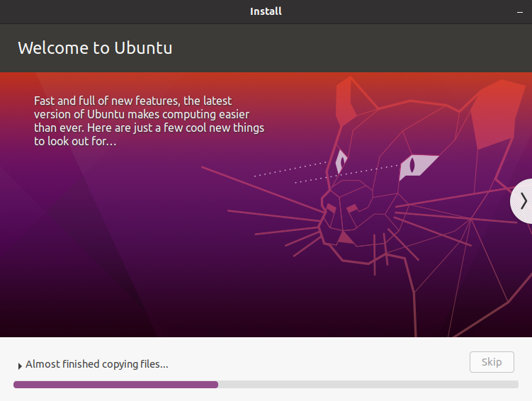

# Ubuntu 20.04LTS installation into the LVM on the LUKS volume

Installation requires 3 scripts. 
 
- 1-pre-install.sh
- 2-para-install.sh
- 3-post-install.sh

Each script have to be executed as sourced style. For example :
```shell
source 1-pre-install.sh
```
If you execute these script as independent command style, it will show an error message and terminate immediately. 

The first step has parameter configuration, erasing disk, format partition, and encryption. This is most critical stage of the entire installation. You have to finish this stage before invoking Ubiquity installer. 

The timing of the 2nd step is little bit difficult. You have to execute this script after the Ubiquity installer starts to copy the file, and before the Ubiquity installer finishes. 

The third stage is easy. There is nothing user can do. Everything is automatic. 
# Preparation

# Installation
Follow the steps below. 

## Configuration parameters
This is very critical part of the installation. The configuration parameters are located in the top of the 1-pre-install.sh. Edit these parameter before installation. Following is a set of the default parameters for the configuration of : 
- Install to  **/dev/sda** (DEV).
- Erase entire disk (ERASEALL).
- In case of EFI firmware, 100MB is allocated to the EFI partition (EFISIZE).
- Create a logical volume group named "vg1" in the encrypted volume (VGNAME)
- Create a swap logical volume named "swap" in the "vg1". The size is 8GB (LVSWAPNAME,LVSWAPSIZE)
- Create a logical volume named **"ubuntu"** for / in the "vg1". The size of the **50%** of the entire free space (LVROOTNAME, LVROOTSIZE).

```bash
# Storage device to install the linux.  
export DEV="/dev/sda"

# Whether you want to erase all contents of the storage device or not.
# 1 : Yes, I want to erase all.
# 0 : No, I don't. I want to add to the existing LUKS volume. 
export ERASEALL=1

# Logical Volume name for your Linux installation. Keep it unique from other distribution.
export LVROOTNAME="ubuntu"

# Logical volume size of the Linux installation.
# 30% mean, new logical volume will use 30% of the free space in the LVM volume group.
# For example, assume the free space is 100GB, and LVROOTSIZE is 30%FREE. Script will create 30GB logical volume.  
export LVROOTSIZE="50%FREE"

# Set the size of EFI partition and swap partition. The unit is Byte. you can use M,G... notation.
export EFISIZE="100M"
export LVSWAPSIZE="8G"

# Usually, these names can be left untouched. 
# If you change, keep them consistent through all instllation in your system.
export CRYPTPARTNAME="luks_volume"
export VGNAME="vg1"
export LVSWAPNAME="swap"
```

There are several restrictions : 
- For the first distribution installation, you must set ERASEALL to 1, to erase entire screen and create a LUKS partition. YaFDE script create a maximum LUKS partition as possible. 
- The LVROOMNAME must be unique among all installation in a computer. Otherwise, the installer terminate at a middle. 
- The LVSWAPNAME must be unique among all installation in a computer. Otherwise, the installer create an unnecessary logical volume. This is waste of storage resource. 
- The EFISIZE and the LVSWAPSIZE are refereed during the first distribution installation. 
- The LVROOTSIZE is the size of a logical volume to create. This is a relative value to the existing free space in the volume group. If you want to install 3 distributions in a computer, you may want to set 33%FREE, 50%FREE, and 100%FREE for the first, second, and third distribution installation, respectively. 
## Preparation of shell window
First of all, promote the shell to root. Almost of the procedure requires root privilege. Not that the scripts requires Bash. 
```bash
# Promote to the root user
sudo -i
```
## The first script
After you set the configuration parameters correctly, execute the following command from the shell. Again, you have to be promoted as root user, and you have to use Bash.  
```bash
source 1-pre-install.sh
```
After the several interactive confirmation, script will as you input the passphrase. This passphrase will be applied to the encryption of the LUKS volume. Make sure you use identical passphrase between all distribution installation in a computer. Otherwise, install process terminates with error.  

## Run the Ubiquity installer 
After the first script finishes, open the Ubiquity installer, configure and run it. Ensure you map the followings correctly.
Host Volume            | Target Directory | Comment
-----------------------|------------------|---------------------------------------------------------------
/dev/sda1              | /boot/efi        | BIOS system doesn't need this mapping
/dev/mapper/vg1-ubuntu | /                | Host volume name is up to your configuration parameter.
/dev/mapper/swap       | swap             | Only the first distribution installation requires this mapping.

C A U T I O N : After the Ubiquity installer starts the file copy, execute 2nd step script quickly before the installer finishes. 


## The second script
Run the following script on the shell window, during the Ubiquity runs. Otherwise, Ubiquity fails at the end of installation. If you run this script too early, it terminates with error message. This is safe. Run it again later ( but before Ubiquity finish).

C A U T I O N : Do not reboot at the end of Ubiquity installation. Click "continue". 

```bash
source 2-para-install.sh
```


## Click continue
As explained above, do not reboot. Click "Continue Testing". If you reboot at here, system will ask you the passphrase twice.


## The third script
After Ubiquity finish the installation, run the 3rd script. This is fully automatic. There is nothing you have to do.
```bash
source post-install.sh
```
You can reboot after the script finishes. 
